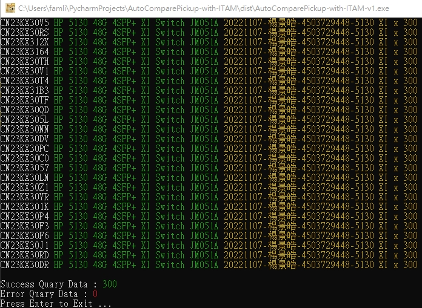
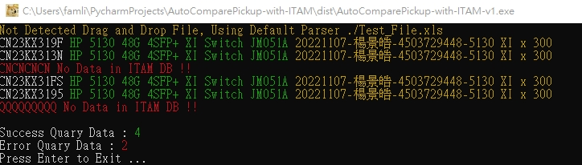

# AutoComparePickup-with-ITAM 

# 領貨清單與KB上的DataBase做比對
## 此程式可實現
  - 即時連線至KB-DataBase做SN比對。
  - 回報領貨清單上的設備，有幾筆是在ITAM中，以及幾筆資料不在ITAM中。
  - 使用預設檔名 Test_File.xls 及可做動。
  - 也可以用拖拉的方式，將檔案拖到.exe上，則會使用指定的檔案去做比對。

## Logs
   * Version v1
     - 初版開發完成。

## Example :
此範例，完整比對300比資料，確認領貨都有在ITAM之中。

此範例，示範如果有錯誤序號，可以比對出不在ITAM之中，避免將尚未進貨的設備移轉進廠。

## Useage
    #Init for Virtual Env 建立虛擬環境。
    virtualenv venv
    
    #Active Virtual Env 進入虛擬環境。
    source ./venv/bin/activate
    
    #Install Requirements 安裝所需要之套件。
    pip install -r requirements.txt
    
    #Use it 準備就緒，可以直接執行，看看結果再行調整。
    python ./main.py
    
    or （如果想要打包為單一執行檔，下面就是打包的指令。）
    pyinstaller -F ./main.py -n ./AutoComparePickup-with-ITAM -i ico.ico
    
    #運作結束後，離開虛擬環境。
    deactivate
